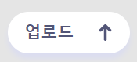
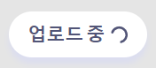
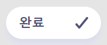
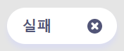
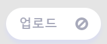
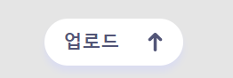
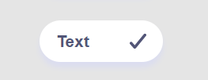

###### Connect To Front-end

# Icon, UploadButton Component

## 사용법

<br/>

컴포넌트를 사용하기 위해 UploadButton을 불러온다.

```jsx
import UploadButton from './components/UploadButton.js';
```

<br/>

기본적으로 제공하는 버튼의 상태는 5가지다. 아래와 같이 status에 5가지 중 원하는 상태를 문자열로 입력하여 사용한다.

<table class="tg">
<thead>
  <tr>
    <th class="tg-0pky">상태</th>
    <th class="tg-c3ow">기본</th>
    <th class="tg-0pky">진행</th>
    <th class="tg-0pky">성공</th>
    <th class="tg-0pky">실패</th>
    <th class="tg-c3ow">비활성화</th>
  </tr>
</thead>
<tbody>
  <tr>
    <td class="tg-0pky">status</td>
    <td class="tg-c3ow">idle</td>
    <td class="tg-0pky">pending</td>
    <td class="tg-0pky">resolved</td>
    <td class="tg-0pky">rejected</td>
    <td class="tg-c3ow">disabled</td>
  </tr>
</tbody>
<tbody>
  <tr>
    <td class="tg-0pky">버튼
</td>
    <td class="tg-c3ow">
</td>
    <td class="tg-0pky">
</td>
    <td class="tg-0pky">
</td>
    <td class="tg-0pky">
</td>
    <td class="tg-c3ow">
</td>
  </tr>
</tbody>
</table>

```jsx
<UploadButton status="idle"></UploadButton>
<UploadButton status="pending"></UploadButton>
<UploadButton status="resolved"></UploadButton>
<UploadButton status="rejected"></UploadButton>
<UploadButton status="disabled"></UploadButton>
```

<br/>

status의 기본 값은 idle이다.

```jsx
<UploadButton></UploadButton>
```

결과



<br/>

버튼의 텍스트를 변경하고 싶다면 태그 사이에 텍스트를 입력한다.

```jsx
<UploadButton>Text</UploadButton>
```

버튼의 아이콘을 변경하고 싶다면 src에 아이콘이 있는 경로를 입력한다.

```jsx
<UploadButton src="./assets/icons/type=check-mark.svg">Text</UploadButton>
```

결과


